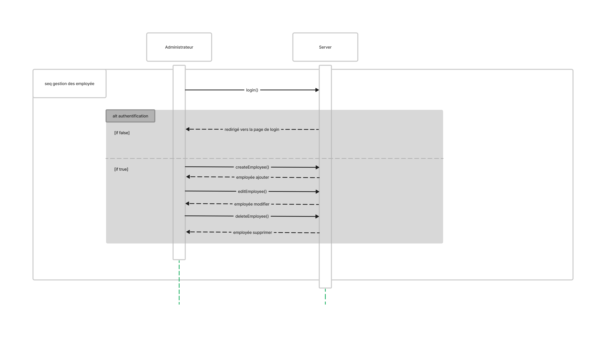
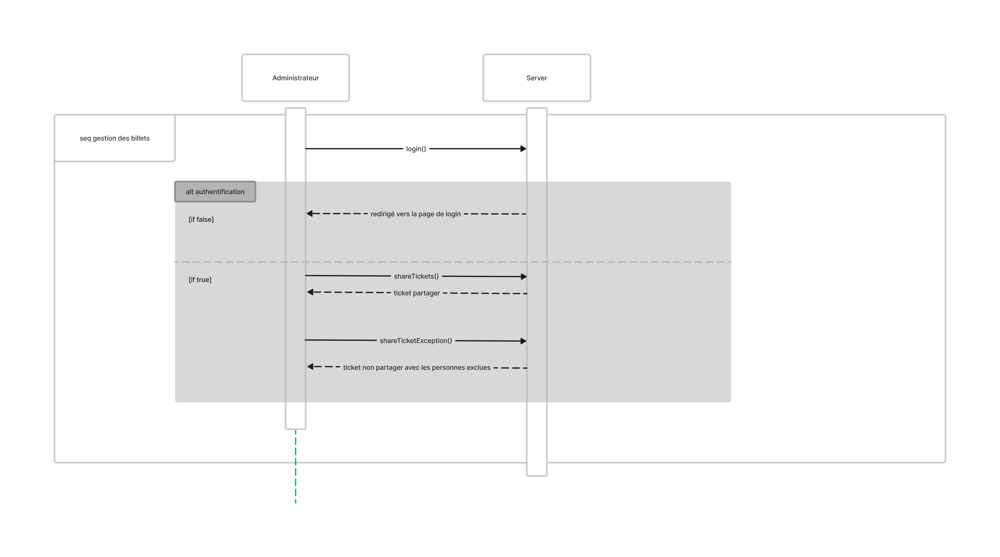

# RED Line

## figma design

https://www.figma.com/file/yr6O6dhRW6JiAJPBai5esa
## diagrams

 - use case:
 

 - class:
    

 - sequence:
   
   - creating an order by employee sequence

    

   -  restaurant managing order sequence

    

   - administartor managing employees sequence

    

   - administrator managing restaurants sequence

    

   - administrator managing tickets

    